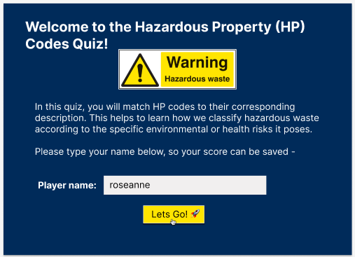
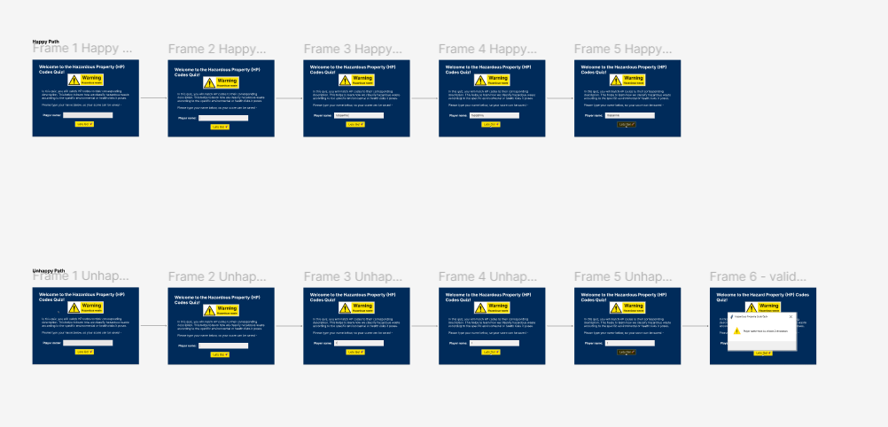
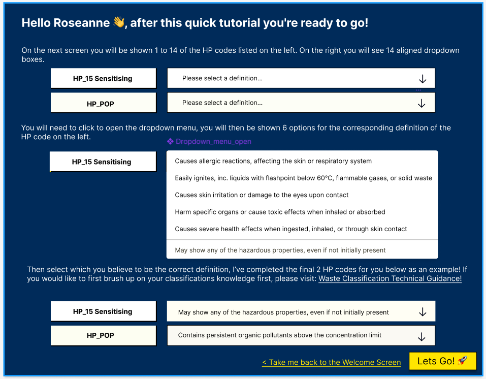
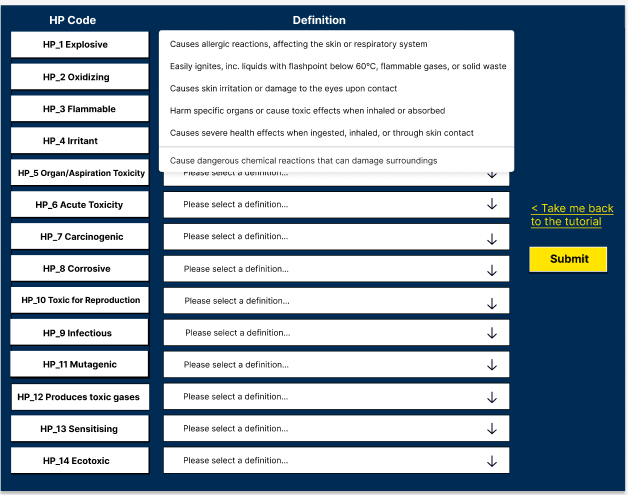
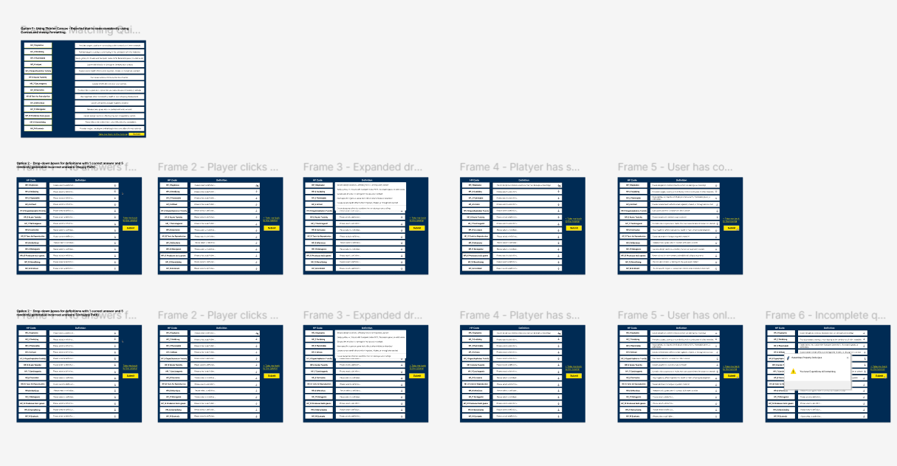
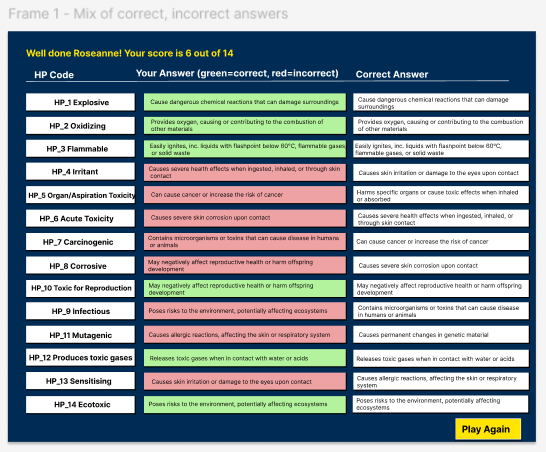
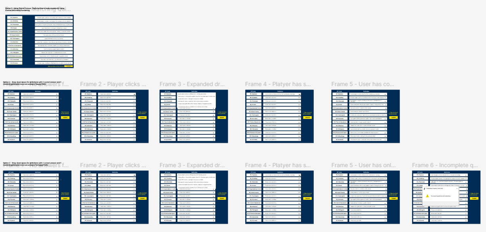
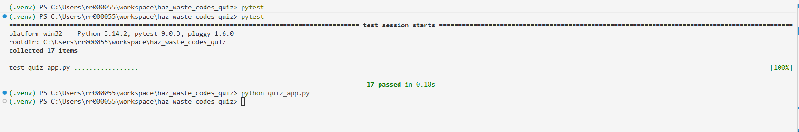

# haz_waste_codes_quiz
A quiz to match up the descriptions of Hazardous Waste codes to their description, built using Tkinter in Python for IFCS Summative 2
<br>

## 1. Introduction
My workplace of the Environment Agency (EA) is a non-departmental public body, who are responsible for protecting and improving the environment across England. One of its core functions is waste regulation, which involves ensuring that businesses and organisations handle, classify, and dispose of waste in accordance with legislation.

Hazardous waste classification is governed by the Hazardous Waste Regulations 2005, key to these are the Hazardous Property (HP) codes, these are a standardised set of 16 codes defining the specific properties that make a waste hazardous. The codes and their definitions and their appropriate uses are outlined in the [GOV.UK Waste Classification Technical Guidance](https://www.gov.uk/government/publications/waste-classification-technical-guidance), which the quiz is based on. The correct application of HP codes is very important to how that waste is managed and disposed of, and misclassification can result in hazardous waste being managed inappropriately, posing significant risks to human health and the environment.

For staff working in Waste Regulation, or the waste industry in general, having a sound working knowledge of the HP code framework is beneficial. There is currently no dedicated interactive tool to support this, Typically, written guidance and on-the-job experience is relied on for understand about HP codes.
The proposed Minimum Viable Product (MVP) is a quiz application built in Python, designed to support developing familiarity with HP codes and their corresponding definitions. Presenting the codes in an interactive format provides an engaging, self-directed learning tool that reinforces understanding in a practical and fun way, supporting teams to maintain sounds knowledge of the codes.
<br>

## 2. Design Section
### 2.1. GUI Design
The GUI was designed using Figma, each screen has been mocked up as a seprate Figma page, with multiple frames to show the user journey.
The full designs are available on Fimga at: [Figma.com Hazardous Property Code Quiz App Design](https://www.figma.com/design/wteUuXcQLdE4QY1SyuXxOZ/Hazardous-Waste-Quiz-App?node-id=10-9&t=g83gNEBu6ETZOKIt-1)

I created several iterations of the design to explore various styles and formats before deciding on one that I thought looked good while also meeting accessability requirements and the limitations of using Tkinter for the build.


<br> **2.1.1 Welcome Screen**


     
The designs consider player name input, cursors options, and the Let's Go button in default, hover, and pressed states. 
The Welcome Screen designs consider both happy and unhappy paths for the player inputting their name, and the error messagebox if validation were to fail.


<br>

<br> **2.1.2. Tutorial Screen**

As a static screen for simple information this was the simplest design to produce, not requiring a user journety mock-up outside of the Let's Begin button in default, hover, and pressed states.

 <br>
<br>

<br> **2.1.3. Quiz Screen**

 <br>

The Quiz Screen was the most difficult to design due to needing to fit 14 rows of dropdowns into a reasonably sized window. This stage however was vital for making early decisions on what would be possible, I discarded multiple designs and Tkinter build functions due to the formating difficulty or complexity to build. The design was initially based upon using Tkinter's canvas module, but with the design difficulty dropdowns were chosen instead.

Happy and unhappy paths were again created to show the error handling if a player were to leave any dropdown boxes blank when submitting.

 <br>


<br> **2.1.4. Results Screen**

 <br>

The results screen was designed within the contraints of the window sizing, as originally each correct snd incorrect question was marked with a tick or cross. However including fields for the marking, HP code, player answers, and correct answers was not possible. This lead to a more concise scoring design of simply colouring the players answer box, green for correct, and red for incorrect. 


<br>
<br>

### 2.2 Requirements
**2.2.1 Functional Requirements**

| ID    | Requirement                                                                                                                                                           |
|-------|-----------------------------------------------------------------------------------------------------------------------------------------------------------------------|
| F1    | The GUI will display a welcome screen with a title and quiz description before the player begins                                                                      |
| F2    | The app must require the player to enter their name before proceeding, displaying a popup error message if the name is invalid                                        |
| F3    | The app must validate the player's name against the following criteria:                                                                                               |
| F4    | The app must validate the player's name against the following criteria:                                                                                               |
| F4.1  |  - The string cannot be empty                                                                                                                                         |
| F4.1  |  - The name must be between 2 characters and 20 characters                                                                                                            |
| F4.1  |  - The name cannot contain numbers or special characters other than hyphens                                                                                           |
| F5    | The app must convert the player's validated name to title case before storing it                                                                                      |
| F6    | The GUI will display a tutorial screen greeting the player by name, explaining the quiz format with static examples of two pre-completed HP code and definition pairs |
| F7    | The GUI will provide a hyperlink to the GOV.UK Waste Classification Technical Guidance on the tutorial screen                                                         |
| F8    | The GUI must allow the player to navigate back to the welcome screen from the tutorial screen                                                                         |
| F9    | The GUI will display a quiz screen showing the remaining 14 HP codes on the left, each with a corresponding dropdown menu on the right                                |
| F10   | Each dropdown shall contain 6 options consisting of the correct definition and 5 randomly selected incorrect definitions                                              |
| F11   | The app must prevent the player from submitting the quiz until all 14 dropdowns have been answered, displaying an error messagebox if submission is attempted before  |
| F12   | The app must calculate the player's score out of 14 total                                                                                                             |
| F13   | The GUI will display a results screen showing:                                                                                                                        |
| F14.1 |  - Player's score                                                                                                                                                     |
| F14.2 |  - Each HP code                                                                                                                                                       | 
| F14.3 |  - The players selected answer highlighted in green if correct or red if incorrect                                                                                    |
| F14.4 |  - The correct answer for each question                                                                                                                               |
| F15   | The app must save the player's name and score to a csv file on completion                                                                                             |
| F16   | The app must append results to the csv file rather than overwriting it, preserving previous results                                                                   |
| F17   | The app must allow the player to return to the welcome screen and play again after viewing their results                                                              |
| F18   | The app must reset the quiz dropdowns if the player chooses to play again                                                                                             |
| F19   | The app must be built using Python 3.9 or higher                                                                                           |

<br>

**2.2.2. Non-functional Requirements**

| ID    | Requirement                                                                                                                                                                         |
|-------|-------------------------------------------------------------------------------------------------------------------------------------------------------------------------------------|
| F1    | The app shall validate all player input without crashing or raising unhandled exceptions, using try/except blocks for file operations and ValueError for incomplete quiz submission |
| F2    | The quiz logic will be implemented as pure functions on the QuizLogic class in logic.py, completely independent of any Tkinter/GUI code                                             |
| F3    | The name validation will be implemented as a pure function validate_name in quiz_logic.py that consistently returns the same output for the same input                              |
| F4    | The code will include unit tests covering:                                                                                                                                          |
| F4.1  |   - Data integrity                                                                                                                                                                  |
| F4.2  |   - Name validation                                                                                                                                                                 |
| F4.3  |   - Match logic                                                                                                                                                                     |
| F4.4  |   - Scoring                                                                                                                                                                         |
| F4.5  |   - Option generation                                                                                                                                                               |
| F4.6  |   - Quiz completion checks                                                                                                                                                          |
| F5    | The code will shall be structured across four separate files by operation:                                                                                                          |
| F5.1  |   - Quiz_dictionary.py for data                                                                                                                                                     |
| F5.2  |   - Quiz_logic.py for logic                                                                                                                                                         |
| F5.3  |   - Results_download.py for csv handling                                                                                                                                            |
| F5.4  |   - Quiz_app.py for the GUI                                                                                                                                                         |
| F6    | All functions, classes and modules across all files are to include descriptive docstrings explaining their purpose, arguments, and return values                                    |
| F7    | The csv file must persist between sessions on the local system, persisting through application restarts                                                                             |
| F8    | The app will handle a missing or empty csv file gracefully, creating the file with a header row automatically                                                                       |
| F9    | The app will present a consistent visual style across all screens using:                                                                                                            |
| F9.1  | Navy background                                                                                                                                                                     |
| F9.2  | White buttons with yellow accent borders to mirror a hazardous waste warning banner                                                                                                 |
| F9.3  | Matching yellow interactive elements                                                                                                                                                |
| F10   | The app shall run on a standard Python installation with Pillow and Pytest as external dependancy via a virtual environment                                                         |
<br>

### 2.3. Tech Stack Outline
**Languages**
- Python
- Github flavoured Markdown
  
**Libraries**
- Tkinter
- csv
- Pytest
- Random
- webbrowser
- regex
- Pillow
- os
  
**Apps/Tools**
- Figma
- io.draw
- VS Codes
- Github

**Storage**
- csv
<br>

### 2.4 Code Design
io.draw has been used to produce a class diagram showing the components of the HP Codes Quiz App relate.

 <br>

`quiz_dictionary` feeds data into both `QuizLogic` and `quiz_app.py` directly. `validate_name` sits outside the class but is called internally by `set_player_name`. `QuizLogic` is instantiated as the quiz object in `quiz_app.y` and all screen logic calls its methods. `results_download` handles the csv persistence, called by `quiz_app` on submit. `test_quiz_app.py` points at the testable units, `validate_name`, `QuizLogic`, and `quiz_dictionary.py`. `quiz_results.csv` works as a file entity that `results_download.py` can read and write to.
<br>
<br>

## 3. Development Section

The app is structured across 4 Python files: `quiz_dictionary.py` for data, `quiz_logic.py` for game logic, `results_download.py` for csv persistence, and `quiz_app.py` for the GUI. This separation ensures logic remains independently testable.
<br>

**3.1, Data: `quiz_dictionary.py`**
The quiz content is stored in 2 dictionaries, `quiz_questions` contains the 14 HP codes used in the quiz, and `tutorial_questions` holds the remaining 2 codes used as static examples on the tutorial screen:

```
quiz_questions = {
    "HP_1 Explosive": "Cause dangerous chemical reactions that can damage surroundings",
    ...}

tutorial_questions = {
    "HP_15": "May show any of the hazardous properties, even if not initially present",
    "HP_POP": "Contains persistent organic pollutants above the concentration limit"}
```
<br>
<br>

**3.2. Logic: `quiz_logic.py`**
This file contains the standalone pure function `validate_name` and the `QuizLogic` class. By keeping all logic independent of Tkinter every function is directly testable with Pytest.
The `validate_name` function strips spaces, converts to title case, and applies 4 validation rules, returning a (bool, str) tuple in all cases so the GUI can display whichever error message is relevant:
```
def validate_name(name):
    name = name.strip().title()
    if len(name) == 0:
        return False, "Player name cannot be empty"
    if not re.fullmatch(r'[a-zA-Z\s\-]+', name):
        return False, "Player name can only contain letters, hyphens, and spaces"
    return True, name
```
`QuizLogic` manages all session states, within it the `prepare_options_for_definition_dropdown` method generates 6 answer options per HP code, which includes the correct definition plus 5 randomly sampled incorrect ones. The `is_complete` method checks whether any dropdowns still hold the default placeholder, raising a ValueError if so. The `get_results_summary` method returns a list of dictionaries containing each item, the player's answer, the correct answer, and a boolean for the results screen to consume.
<br>
<br>

**3.3. Persistence: `results_download.py`**
The 'save_result' function appends the player's name and score to a csv file, creating it with a header row first time. The filepath defaults to 'quiz_results.csv' but can be overridden for testing:
```
def save_result(player_name, score, filepath=results_file):
    try:
        file_exists = os.path.isfile(filepath)
        with open(filepath, 'a', newline='') as csvfile:
            writer = csv.DictWriter(csvfile, fieldnames=['name', 'score'])
            if not file_exists:
                writer.writeheader()
            writer.writerow({'name': player_name, 'score': score})
    except IOError as e:
        raise IOError(f"Could not save result to file: {e}")
```
<br>
<br>

**3.4. GUI: `quiz_app.py`**
The GUI is structured across 4 screens consisting of welcome, tutorial, quiz, and results. Each has a `tk.Frame` shown or hidden using `.pack()` and `.pack_forget()`. On the quiz screen, each HP code is displayed alongside a `ttk.Combobox` populated with 6 options from `prepare_options_for_definition_dropdown`, with each selection stored in a `tk.StringVar` in the `selected_answers` dictionary. On submission, `on_submit` calls `quiz.is_complete(selected_answers)` inside a `try/except` block. If it completes, it records all matches and navigates to the results screen and if not, it displays an error messagebox:
```
def on_submit():
    try:
        quiz.is_complete(selected_answers)
        for item, var in selected_answers.items():
            quiz.attempt_match(item, var.get())
        show_results()
    except ValueError as e:
        messagebox.showerror("Incomplete Quiz", str(e))
```
The results screen is refreshed on each call to `show_results`, ensuring a second attempt always reflects the current session rather than the previous one.
<br>
<br>

## 4. Testing Section

### 4.1.Testing methodology

Two testing approaches have been used, automated unit testing with Pytest for all pure functions and manual testing for the GUI behaviour and player journey.
Automated unit testing was prioritised for `quiz_logic.py`, `quiz_dictionary.py`, and `results_download.py` because these modules contain pure functions that take defined inputs and return consistent outputs, making them straightforward to test in isolation. Pytest was chosen as the testing framework due to its simple syntax and output. Test-driven development (TDD) was followed where possible, so tests were written before their corresponding functions, ensuring each function was designed as testable from the outset.
Manual testing was used for all GUI behaviour as Tkinter widgets cannot be instantiated in a test environment without a display. This covered navigation between screens, styling, dropdown behaviour, and error handling.
<br>

**4.1.1. Manual Testing Outcomes**
|                    Test                   |                     Steps Followed                     |                                Expected result                                |                  Actual result                  | Outcome |   |
|:-----------------------------------------:|:------------------------------------------------------:|:-----------------------------------------------------------------------------:|:-----------------------------------------------:|:-------:|---|
| Empty name submission                     | Leave player name field blank, click Let's Go button   | Error messagebox: "Player name cannot be empty"                               | Error messagebox displayed correctly            | Pass    |   |
| Name with numbers                         | Enter "matt99" in player name field, click Let's Go    | Error messagebox: "Player name can only contain spaces, letters, and hyphens" | Error messagebox displayed correctly            | Pass    |   |
| Valid name entry                          | Enter "rosie" in player name field, click Let's Go     | Proceeds to tutorial screen, with name presented in title case                | Navigated to tutorial screen                    | Pass    |   |
| Hyphenated name                           | Enter "rose-anne" in player name field, click Let's Go | Proceeds, name shown as "Rose-Anne"                                           | Navigated correctly, name displayed as required | Pass    |   |
| Tutorial back button                      | Click built in link back to welcome screen             | Returns to welcome screen                                                     | Returned correctly                              | Pass    |   |
| GOV.UK guidance link                      | Click built in link on tutorial screen                 | Opens GOV.UK Waste Classification Technical Guidance page in browser          | Correct page opened in default browser          | Pass    |   |
| Submit with incomplete dropdowns          | Leave 3 dropdowns unanswered, click Submit button      | Error messagebox showing count of 3 unanswered questions                      | Error messagebox displayed with correct count   | Pass    |   |
| Submit with all dropdowns answered        | Answer all 14 dropdowns, click Submit button           | Navigates to results screen                                                   | Results screen displayed correctly              | Pass    |   |
| Results screen accuracy                   | Answer mix of correct and incorrect questions          | Calculated results out of 14 are correct                                      | Results displayed correctly                     | Pass    |   |
| Results screening colouring functionality | Answer mix of correct and incorrect questions          | Player answers rows colour red/green to indicate correct/incorrect            | Colours displayed correctly                     | Pass    |   |
| csv file creation                         | Complete quiz for first time                           | quiz_results.csv created with header and first row, name, and score captured   | File created correctly                          | Pass    |   |
| csv appending                             | Complete quiz                                          | Additional set of results present in csv file                                 | Both rows present, no overwrite                 | Pass    |   |
| Play again                                | Click Play Again on results screen                     | Returns to welcome screen, quiz dropdowns reset                               | Returned to welcome, dropdowns reset            | Pass    |                              
<br>

**4.1.2. Unit Testing Outcomes**
17 unit tests are written for the testable modules, all of which pass successfully with the final version of the app.
<br>



<br>
Key test cases include validating that:
- `validate_name` correctly rejects empty strings, numeric characters, and names outside the length requirments.
- `prepare_options_for_definition_dropdown` always includes the correct answer, returns exactly 6 options, and contains no duplicates
-  `is_complete` raises a ValueError when unanswered dropdowns are present.
-  Tests for the csv file handler `results_download.py` use Pytest's built-in `tmp_path` to write to a temporary file, keeping the real `quiz_results.csv` unaffected for testing.
<br>

## 5. Documentation Section (User and Technical)

### 5.1. Technical Documentation
System requirements: Windows, Mac, or Linux with Python 3.14 installed with a virtual environment activated.
<br>

**Starting the application:**
1. Open a terminal and navigate to the project folder haz-waste-codes-quiz
2. Once in the project folder, activate the virtual environment: 
- Windows - `.venv\Scripts\activate`
- Mac/Linux - `source .venv/bin/activate`
  <br>
  
**Run the application:**
 `python quiz_app.py`
<br>

**Installing dependencies:**
- python `-m pip install Pillow`
- python `-m pip install pytest`
<br>

**Running tests:**
- python `-m pytest test_quiz_app.py`
<br>

**Project structure:**
  
|         File        |                          Purpose                          |
|:-------------------:|:---------------------------------------------------------:|
| quiz_dictionary.py  | Quiz and tutorial question dictionaries                   |
| quiz_logic.py       | validate_name function and QuizLogic class                |
| results_download.py | csv read and write functions                              |
| quiz_app.py         | Tkinter GUI across four screens                           |
| test_quiz_app.py    | Pytest unit tests                                         |
| quiz_results.csv    | Persistent results storage, auto-created on first run     |
| images/warning.png  | Hazardous waste warning image displayed on welcome screen |
<br>
The `QuizLogic` class is instantiated once in `quiz_app.py` as `quiz = QuizLogic(quiz_questions)` and its methods are called by each screen as the player progresses. All csv operations are wrapped in `try/except` blocks, so any `IOError` raised by `results_download.py` is caught in `quiz_app.py` and displayed as an error messagebox rather than crashing the app.
<br>

### 5.2. User Documentation
**Playing the quiz:**
- Enter your name in the Player Name entrybox on the welcome screen and click the Let's Go button. Names must be between 2 and 20 characters and contain only letters, hyphens, and spaces.
- Read through the tutorial screen to understand the quiz format. Click the GOV.UK link if you would like to review the Waste Classification guidance before starting.
- On the quiz screen, use the dropdown aligned against each HP code to select the definition you think matches it. Each dropdown shows 6 options with 1 correct and 5 incorrect.
- Once you have answered all 14 dropdowns, click the Submit button. If you have left any dropdowns unanswered an error messagebox will appear indicating how many remain before you can progress.
- The results screen will display your score and show each answer highlighted in green if correct or red if incorrect, alongside the correct definition for reference.
- Click the Play Again button to retake the quiz.
<br>

## 6. Evaluation Section
### What went well
The decision to separate logic from the GUI early in development proved to be a very beneficial architectural choice made during the project. Having `quiz_logic.py` completely independent of Tkinter meant that functions could be written, tested, and verified before a single line of GUI code was written, which made debugging significantly easier throughout. When issues arose in the GUI, the underlying logic could be ruled out immediately because it was already covered by passing tests and meant it was simpler for fix.
Following a test-driven approach for the logic layer also encouraged clearer function design and writing the tests first required thinking precisely about inputs, outputs, and edge cases before implementation, which resulted in clean focused functions.
The use of Figma for visual design before building the GUI was also beneficial. I explored different quiz designs such as using Tkinter's canvas function, but was able to rule these out based on the difficulty to format even in Figma. The Figma design allowed me to work through formating difficulties early on, and being able to references back to the design meant saving considerable time during the GUI build.
<br>

### What could be improved
The quiz currently generates 6 answer options randomly each time the application runs, which means the same incorrect options are never guaranteed to appear consistently. For a training tool, it would be more educationally effective to curate specific distractors such as incorrect answers that are plausibly similar to the correct one, this would better test genuine understanding rather.
Additionally, the results screen currently has no scroll functionality, requiring careful font and padding management to fit in the 14 rows in a fixed window. A scrollable canvas would be a more robust solution, particularly if the quiz were extended to cover all 16 HP codes in a future iteration.
The app also has no mechanism to prevent a player from seeing the same incorrect options repeatedly across multiple attempts. Adding a more sophisticated option generation strategy would improve the learning value for players who retake the quiz.
I also found I was somewhat limited by the styling available in Tkinter, for any future iterations there may be other GUI design libraries that could be used for better visuals considering my quiz screen requirements. For example, using something such as Streamlit would have made it easier to surface the app to my employer as well.

